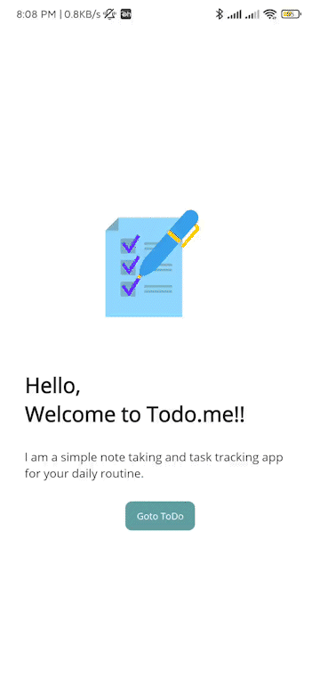
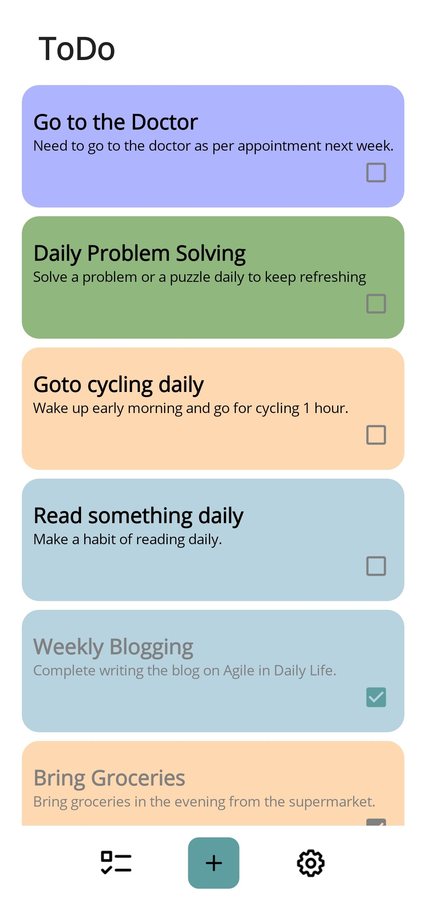
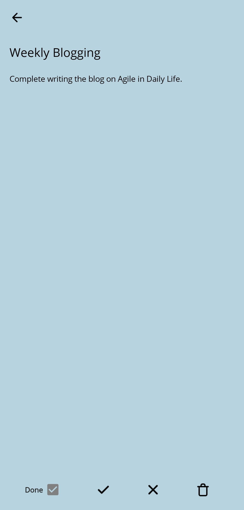

# [Todo.me](https://github.com/behl1anmol/Todo.me)   
Todo.me is a simple note taking and task tracking app made with .NET MAUI.

### Platforms

- [x] Android
- [?] Windows (Work in progress)

## Features
* Lottie Animations
* Randomly set backgroung color for every Todo item
* ColletionView
* SwipeView
* MVVM
* Borders

## Preview
 &nbsp;&nbsp;&nbsp; 
 &nbsp;&nbsp;&nbsp; 
  

### More information
- Author: [Anmol Behl](https://github.com/behl1anmol)
- Source code: [https://github.com/behl1anmol/Todo.me](https://github.com/behl1anmol/Todo.me)
- Future planned features:
	* Integrating Agile Methodology to better manage daily routine
	* iOS Support
